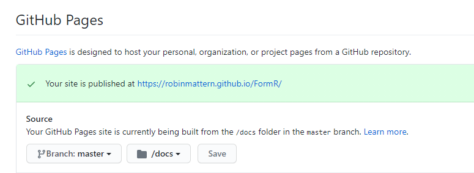

<style>
    body { font-size:  15pt; }  /* 10pt is the default size */
    p  { line-height: 1.2em; }  /* 1.4em is the default line-height */
    p  { margin:        0em; }  /* .5em is the default top and bottom margin */
</style>

## Hello from docs/README.html

This is a Docsify SPA (Single Page Application) containing Markdown pages
describing the building of a VPS (Virtual Private Server) to run our FormR
client / server application to quickly and easily edit database tables.   

Docsify was discovered by Fillip, and implemented at http://awesome.imade3d.com. 
He introduced us to writing Markdown pages that are stored in a central repository
at GitHub.  That turned out to be a great solution for multiple people authoring documentation for IMADE3D printers.

While there is some magic to moving the edited Markdown pages to the imade3d server,
it turns out that 
- GitHub can publish the Docsify pages in a webserver available for each repository, and 
- Docsify can render the documentation from with VSCode while it is being edited  

All that is needed is to put three initial files into a folder named docs.  
  ``` 
  ./docs/index.html -- contains links to the Docsify .css and .js code
  ./docs/README.md -- the main documentation page
  ./docs/_sidebar.md -- contains links to all other Markdown files
  ``` 
Then after the repository is pushed up to Github, all that is needed is to goto `Settings` for the repository and turn on GitHub pages.  Note, it can only be done 
by the owner of the repository.  




